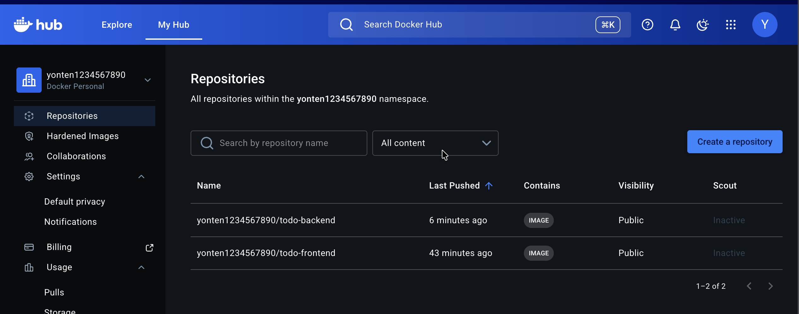
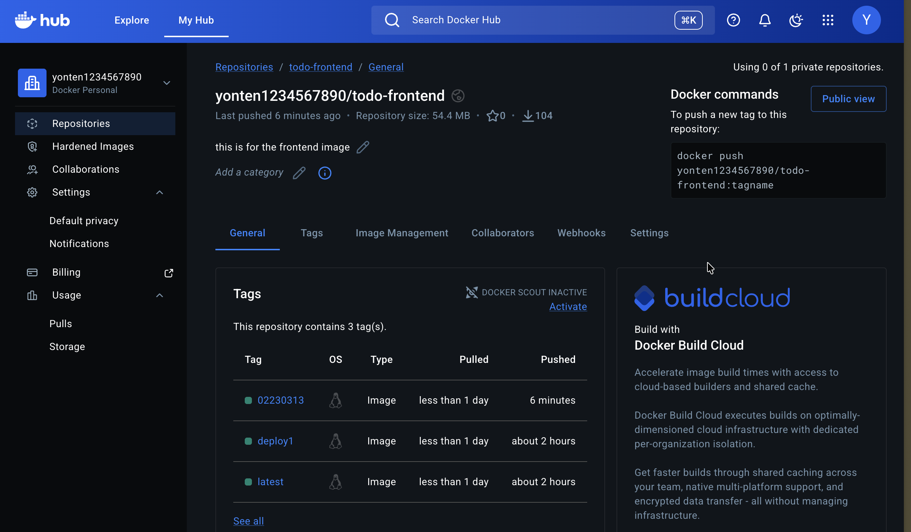
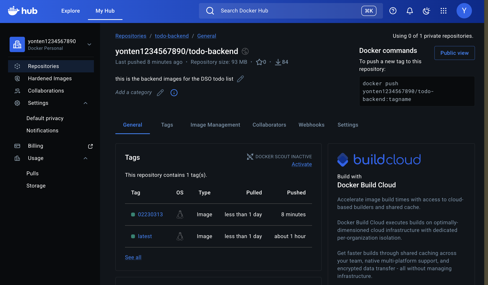
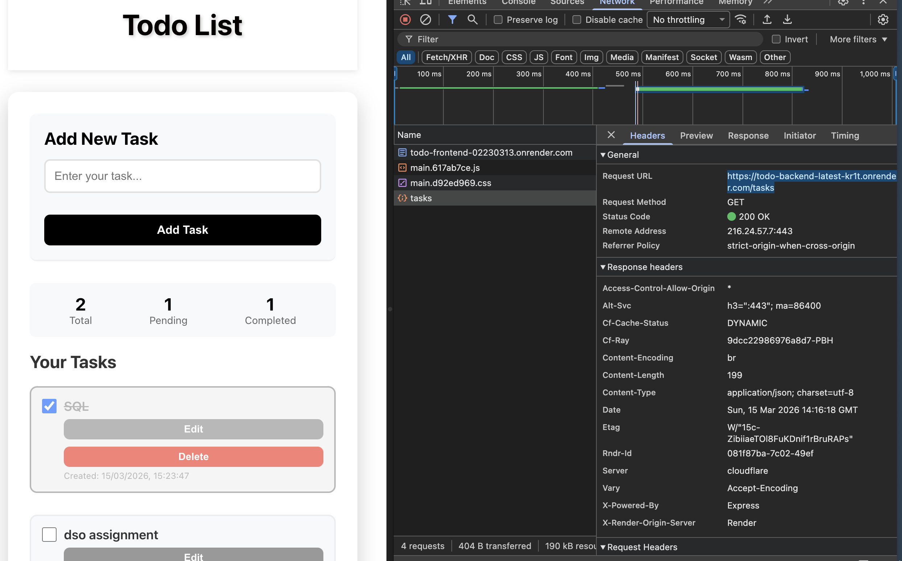

# DSO101 Assignment 1 - Todo Application

Student Name: Yonten Kinley Tenzin  
Student ID: 02230313

GitHub Repository: [YontenKinleyTenzin_02230313_DSO101_A1](https://github.com/Kinleyjigs/YontenKinleyTenzin_02230313_DSO101_A1.git)

[LIVE Deployed](https://todo-frontend-02230313.onrender.com/)

## 1. Project Overview 

This is a full-stack Todo List web application with:
- Frontend (React): Add, edit, delete, and mark tasks complete.
- Backend (Node.js + Express): CRUD API for tasks.
- Database (PostgreSQL): Persistent storage.

## 2. Tech Stack

- Frontend: React + Axios
- Backend: Node.js + Express
- Database: PostgreSQL
- Containerization: Docker + Docker Compose
- Deployment: Render + Docker Hub

## 3. Environment Variables (.env)

Environment variables are used for environment-specific values (API URL, DB credentials, server port).

Important rule:
- Never commit real `.env` files to Git.
- `.env` is ignored in `.gitignore`.
- Use example/template files for reference.

### Backend .env variables

Create `backend/.env` from `backend/.env.example`:

```env
DB_HOST=localhost
DB_USER=postgres
DB_PASSWORD=your_password
DB_NAME=todo_db
DB_PORT=5432
PORT=5000
```

### Frontend .env variables

Create `frontend/.env` from `frontend/.env.example`:

```env
REACT_APP_API_URL=http://localhost:5000
```

For production, set this to your live backend URL, for example:

```env
REACT_APP_API_URL=https://be-todo.onrender.com
```

## 4. How Frontend, Backend, and DB Are Connected

Local/dev connection flow:
1. Frontend sends API requests to `REACT_APP_API_URL`.
2. Backend receives requests on `PORT` (default `5000`).
3. Backend connects to PostgreSQL using `DB_HOST`, `DB_USER`, `DB_PASSWORD`, `DB_NAME`, `DB_PORT`.
4. Backend performs CRUD and returns JSON to frontend.

Render connection flow:
1. Frontend service uses `REACT_APP_API_URL=https://be-todo.onrender.com`.
2. Backend service receives DB credentials via Render environment variables (or Render linked DB values).
3. Backend connects to Render PostgreSQL and serves API responses.

Current API endpoints:
- `GET /tasks`
- `POST /tasks`
- `PUT /tasks/:id`
- `DELETE /tasks/:id`

## 5. Local Run Instructions

### Option A: Run services individually

Backend:

```bash
cd backend
npm install
cp .env.example .env
npm run dev
```

Frontend:

```bash
cd frontend
npm install
cp .env.example .env
npm start
```

### Option B: Run using Docker Compose

From project root:

```bash
docker-compose up --build
```

Default ports from compose:
- Frontend: `http://localhost`
- Backend: `http://localhost:5001`
- PostgreSQL: `localhost:5432`

## 6. Part A - Build and Push Pre-built Images to Docker Hub

Requirement: Use student ID as the image tag.

Backend image:

```bash
docker build -t yonten1234567890/todo-backend:02230313 ./backend
docker push yonten1234567890/todo-backend:02230313
```

Frontend image:

```bash
docker build -t yonten1234567890/todo-frontend:02230313 ./frontend
docker push yonten1234567890/todo-frontend:02230313
```

## 7. Part A - Deploy Docker Images on Render

Backend web service:
- Deploy from existing Docker Hub image: `yonten1234567890/todo-backend:02230313`
- Set environment variables:
   - `DB_HOST`
   - `DB_USER`
   - `DB_PASSWORD`
   - `DB_NAME`
   - `DB_PORT`
   - `PORT=5000`

Frontend web service:
- Deploy from existing Docker Hub image: `yonten1234567890/todo-frontend:02230313`
- Set:
   - `REACT_APP_API_URL=https://be-todo.onrender.com`

Database:
- Use Render PostgreSQL managed database.

## 8. Part B - Automated Build and Deployment from GitHub (Blueprint)

This repository includes `render.yaml` for multi-service deployment:
- Backend service built from `backend/Dockerfile`
- Frontend service built from `frontend/Dockerfile`
- Managed PostgreSQL database

Render Blueprint behavior:
- On each new Git commit pushed to GitHub, Render rebuilds and redeploys services automatically.

## 9. Live Deployment Links

- Frontend: https://todo-frontend-02230313.onrender.com/
- Backend API: https://todo-backend-latest-kr1t.onrender.com

Quick API test:

```bash
curl https://todo-backend-latest-kr1t.onrender.com/tasks
```

## 10. Evidence / Screenshots

### Local Development


Figure 1: Local development environment showing the Todo application running on localhost.

### Docker Hub Repository


Figure 2: Docker Hub repository containing the published frontend and backend images.

### Docker Hub Frontend Image


Figure 3: Frontend Docker image tagged and pushed to Docker Hub.

### Docker Hub Backend Image


Figure 4: Backend Docker image tagged and pushed to Docker Hub.

### Render Deployment


Figure 5: Manual Render deployment using pre-built Docker images from Docker Hub.

- This shows the manual deployment process on Render. In this approach, I first build Docker images, push them to Docker Hub, and then configure Render to pull and run those images.

### Render Deployment through Blueprint 


Figure 6: Render Blueprint deployment configured to automatically build and redeploy on each GitHub commit.

### Live Application


Figure 7: Live Todo application interface deployed on Render.

- This shows deployment on Render using Blueprint. With Blueprint, Render builds and deploys directly from the GitHub repository, so there is no need to manually push and pull Docker Hub images for every update. After configuring the required environment variables once, each new commit triggers an automatic rebuild and redeployment, which is more efficient and aligns with the assignment requirement.

## 11. References
- react documentation: https://react.dev/
- Docker documentation: https://docs.docker.com/
- Build and push image: https://docs.docker.com/get-started/introduction/build-and-push-first-image/
- Render image deployment: https://render.com/docs/deploying-an-image
- Render environment variables: https://render.com/docs/configure-environment-variables
- Render Blueprint spec: https://render.com/docs/blueprint-spec

