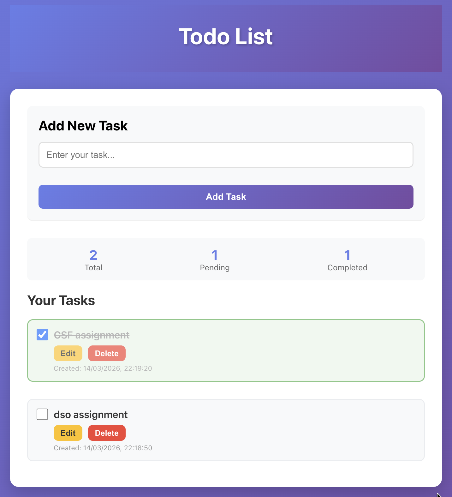
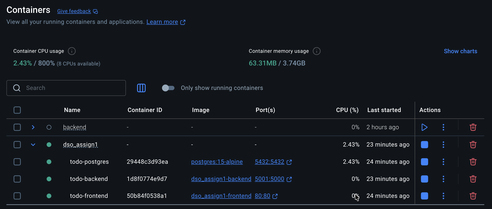

# Todo Application- DSO Assignment 1
**Student Name:**  Yonten Kinley Tenzin

**Student ID:** 02230313  

---

## Overview

This project implements a full-stack todo application with:
- **Frontend**: React-based UI for task management
- **Backend**: RESTful API built with Node.js and Express
- **Database**: PostgreSQL for data persistence
- **Containerization**: Docker for backend and frontend
- **Deployment**: Automated CI/CD on Render.com

---

## Tech Stack

| Component | Technology |
|-----------|------------|
| Frontend | React 18, Axios, CSS3 |
| Backend | Node.js, Express.js |
| Database | PostgreSQL |
| Containerization | Docker, Docker Compose |
| Deployment | Render.com |
| Version Control | Git, GitHub |

---


##  Web Application Setup

### Backend Setup

The backend is a RESTful API built with Express.js and PostgreSQL.

#### Features:
- CRUD operations for tasks
- PostgreSQL database integration
- Environment variable configuration
- CORS enabled for frontend communication
- Auto-initialization of database tables

#### Environment Variables (backend/.env):
```env
DB_HOST=localhost
DB_USER=postgres
DB_PASSWORD=your_local_postgres_password
DB_NAME=todo_db
DB_PORT=5432
PORT=5000
```

#### Running Backend Locally:
```bash
cd backend
npm install
npm start
```

Server runs on: `http://localhost:5000`

---

### Frontend Setup

The frontend is a React application with a clean, responsive UI.

#### Features:
- Add new tasks with title
- Mark tasks as complete/incomplete
- Edit existing tasks
- Delete tasks
- Real-time task statistics
- Responsive design

#### Environment Variables (frontend/.env):
```env
REACT_APP_API_URL=http://localhost:5001
```

#### Running Frontend Locally:
```bash
cd frontend
npm install
npm start
```

Application runs on: `http://localhost:3000`

---

## Part A: Docker Hub Deployment

### Step 1: Build Docker Images

#### Backend Image:
```bash
cd backend
docker build -t yourdockerhubusername/be-todo:02230313 .
```

#### Frontend Image:
```bash
cd frontend
docker build -t yourdockerhubusername/fe-todo:02230313 .
```

**Note:** Replace `yourdockerhubusername` with your Docker Hub username and `02230313` with your student ID.

### Step 2: Push to Docker Hub

```bash
# Login to Docker Hub
docker login

# Push backend image
docker push yourdockerhubusername/be-todo:02230313

# Push frontend image
docker push yourdockerhubusername/fe-todo:02230313
```

### Step 3: Deploy on Render.com

#### A. Create PostgreSQL Database
1. Go to Render Dashboard
2. Click "New" → "PostgreSQL"
3. Configure database:
   - Name: `todo-db`
   - Database: `todo_db`
   - User: `todo_user`
4. Note the connection details (Internal Database URL)

#### B. Deploy Backend Service
1. Click "New" → "Web Service"
2. Select "Existing image from Docker Hub"
3. Image URL: `yourdockerhubusername/be-todo:02230313`
4. Configure:
   - Name: `be-todo`
   - Region: Choose closest
5. Add Environment Variables:
   ```
   DB_HOST=<from Render PostgreSQL dashboard>
   DB_USER=todo_user
   DB_PASSWORD=<from Render PostgreSQL dashboard>
   DB_NAME=todo_db
   DB_PORT=5432
   PORT=5000
   ```
6. Deploy!

#### C. Deploy Frontend Service
1. Click "New" → "Web Service"
2. Select "Existing image from Docker Hub"
3. Image URL: `yourdockerhubusername/fe-todo:02230313`
4. Configure:
   - Name: `fe-todo`
   - Region: Choose closest
5. Add Environment Variables:
   ```
   REACT_APP_API_URL=https://be-todo.onrender.com
   ```
   (Replace with your actual backend URL)
6. Deploy!

---

## Part B: Automated Deployment

This setup enables automatic rebuilds and deployments whenever you push code to GitHub.

### Step 1: Create GitHub Repository

```bash
cd DSO_assign1
git init
git add .
git commit -m "Initial commit: Todo application with Docker"
git branch -M main
git remote add origin https://github.com/yourusername/yourrepo.git
git push -u origin main
```

### Step 2: Configure render.yaml

The `render.yaml` file in the root directory defines the infrastructure:

```yaml
services:
  - type: web
    name: be-todo
    env: docker
    dockerfilePath: ./backend/Dockerfile
    # ... environment variables ...

  - type: web
    name: fe-todo
    env: docker
    dockerfilePath: ./frontend/Dockerfile
    # ... environment variables ...

databases:
  - name: todo-db
    databaseName: todo_db
    user: todo_user
```

### Step 3: Deploy Blueprint on Render

1. Go to Render Dashboard
2. Click "New" → "Blueprint"
3. Connect your GitHub repository
4. Select the repository
5. Render will detect `render.yaml` automatically
6. Click "Apply"

**Now, every time you push to GitHub, Render will automatically rebuild and redeploy your application!**

---

## Local Development

### Using Docker Compose

The easiest way to run the entire stack locally:

```bash
# Start all services (database, backend, frontend)
docker-compose up -d

# View logs
docker-compose logs -f

# Stop all services
docker-compose down
```

Services will be available at:
- Frontend: `http://localhost:80`
- Backend: `http://localhost:5001`
- PostgreSQL: `localhost:5432`

### Manual Setup (Without Docker)

#### Prerequisites:
- Node.js 18+
- PostgreSQL 12+

#### Steps:
1. **Setup Database:**
   ```bash
   # Login to PostgreSQL
   psql -U postgres
   
   # Create database
   CREATE DATABASE todo_db;
   ```

2. **Start Backend:**
   ```bash
   cd backend
   cp .env.example .env
   # Edit .env with your database credentials
   npm install
   npm start
   ```

3. **Start Frontend:**
   ```bash
   cd frontend
   cp .env.example .env
   # Edit .env with backend URL
   npm install
   npm start
   ```

---

## Environment Variables

### Backend Variables

| Variable | Description | Example |
|----------|-------------|---------|
| DB_HOST | Database host | localhost or render-host |
| DB_USER | Database user | postgres |
| DB_PASSWORD | Database password | your_password |
| DB_NAME | Database name | todo_db |
| DB_PORT | Database port | 5432 |
| PORT | Server port | 5000 |

### Frontend Variables

| Variable | Description | Example |
|----------|-------------|---------|
| REACT_APP_API_URL | Backend API URL | http://localhost:5001 |

**Important:** 
- Never commit `.env` files to Git
- Use `.env.example` as templates
- Update environment variables on Render dashboard for production

---

## API Documentation

### Base URL
- Local: `http://localhost:5001`
- Production: `https://be-todo.onrender.com`

### Endpoints

#### Health Check
```http
GET /
```
Response:
```json
{
  "message": "Todo API is running!",
  "status": "success"
}
```

#### Get All Tasks
```http
GET /tasks
```
Response:
```json
{
  "message": "Tasks retrieved successfully",
  "count": 2,
  "tasks": [
    {
      "id": 1,
      "title": "Sample Task",
      "completed": false,
      "created_at": "2024-03-11T10:00:00Z",
      "updated_at": "2026-03-11T10:00:00Z"
    }
  ]
}
```

#### Create Task
```http
POST /tasks
Content-Type: application/json

{
  "title": "New Task"
}
```

#### Update Task
```http
PUT /tasks/:id
Content-Type: application/json

{
  "title": "Updated Title",
  "completed": true
}
```

#### Delete Task
```http
DELETE /tasks/:id
```

---

## Deployment Links

### Part A Deployment (Docker Hub Images)
- **Frontend**: [https://fe-todo-partA.onrender.com](URL_HERE)
- **Backend**: [https://be-todo-partA.onrender.com](URL_HERE)
- **Docker Hub Backend**: [https://hub.docker.com/r/username/be-todo](URL_HERE)
- **Docker Hub Frontend**: [https://hub.docker.com/r/username/fe-todo](URL_HERE)

### Part B Deployment (Automated via GitHub)
- **Frontend**: [https://fe-todo.onrender.com](URL_HERE)
- **Backend**: [https://be-todo.onrender.com](URL_HERE)
- **GitHub Repository**: [https://github.com/username/repo](URL_HERE)

---

## Screenshots

### Local Development


### Docker Hub


### Render Deployment


### Application UI


---

## Testing

### Test Backend API
```bash
# Health check
curl http://localhost:5001/

# Get all tasks
curl http://localhost:5001/tasks

# Create a task
curl -X POST http://localhost:5001/tasks \
  -H "Content-Type: application/json" \
  -d '{"title":"Test Task"}'
```

### Test Frontend
1. Navigate to `http://localhost:3000`
2. Add a new task
3. Mark task as complete
4. Edit task
5. Delete task

---

## Troubleshooting

### Backend won't start
- Check PostgreSQL is running
- Verify database credentials in `.env`
- Ensure database exists: `CREATE DATABASE todo_db;`

### Frontend can't connect to backend
- Verify `REACT_APP_API_URL` in frontend `.env`
- Check backend is running on port 5000
- Ensure CORS is enabled in backend

### Docker build fails
- Check Dockerfile syntax
- Ensure all files are copied correctly
- Verify base image is accessible

### Render deployment issues
- Check environment variables are set correctly
- Verify Docker Hub images are public
- Check Render logs for errors

---

## Resources

- [Docker Documentation](https://docs.docker.com/)
- [Render Documentation](https://render.com/docs)
- [Express.js Guide](https://expressjs.com/)
- [React Documentation](https://react.dev/)
- [PostgreSQL Tutorial](https://www.postgresql.org/docs/)

---


